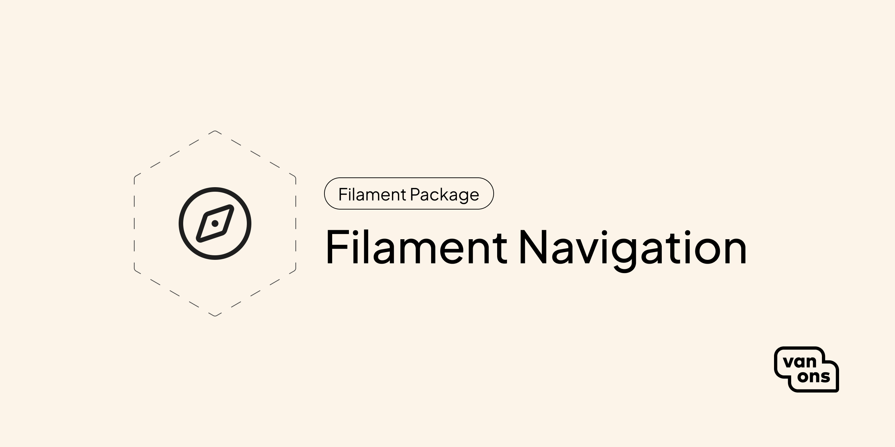

<p align="center"></p>

# Filament Navigation

<!-- BADGES -->

This plugin for Filament provides a `Navigation` resource that lets you build structural navigation menus with a clean drag-and-drop UI.

## Quick start

### Installation

Start by installing the package via Composer:

```bash
composer require van-ons/filament-navigation
```

Next, run the migrations:

```sh
php artisan migrate
```

Finally, publish the package's assets:

```sh
php artisan filament:assets
```

### Usage

You first need to register the plugin with Filament. This can be done inside your `PanelProvider`, e.g. `AdminPanelProvider`.

```php
use VanOns\FilamentNavigation\FilamentNavigation;

return $panel
    ->plugin(FilamentNavigation::make());
```

If you wish to customise the navigation group, sort or icon, you can use the `NavigationResource::navigationGroup()`, `NavigationResource::navigationSort()` and `NavigationResource::navigationIcon()` methods.

### Data structure

Each navigation menu is required to have a `name` and `handle`. The `handle` should be unique and used to retrieve the menu.

Items are stored inside a JSON column called `items`. This is a recursive data structure that looks like:

```json
[
    {
        "label": "Home",
        "type": "external-link",
        "data": {
            "url": "/",
            "target": "_blank",
        },
        "children": [
            // ...
        ],
    }
]
```

The recursive structure makes it really simple to render nested menus / dropdowns:

```blade
<ul>
    @foreach($menu->items as $item)
        <li>
            {{ $item['label'] }}

            @if($item['children'])
                <ul>
                    {{-- Render the item's children here... --}}
                </ul>
            @endif
        </li>
    @endforeach
</ul>
```

### Retrieving a navigation object

To retrieve a navigation object, provide the handle to the `VanOns\FilamentNavigation\Models\Navigation::fromHandle()` method.

```php
use VanOns\FilamentNavigation\Models\Navigation;

$menu = Navigation::fromHandle('main-menu');
```

### Custom item types

Out of the box, this plugin comes with a single "item type" called "External link". This item type expects a URL to be provided and an optional "target" (same tab or new tab).

It's possible to extend the plugin with custom item types. Custom item types have a name and an array of Filament field objects (or a `Closure` that produces an array) that will be displayed inside the "Item" modal.

This API allows you to deeply integrate navigation menus with your application's own entities and models.

```php
return $panel
    ->plugin(
        FilamentNavigation::make()
            ->itemType('post', [
                Select::make('post_id')
                    ->//...
            ])
    );
```

All custom fields for the item type can be found inside the `data` property on the item.

### Global custom fields

There might be cases where you want all item types to have an additional set of fields. This is useful for classes, custom IDs and more.

To register global custom fields, use the `withExtraFields()` method on the plugin object.

```php
return $panel
    ->plugin(
        FilamentNavigation::make()
            ->withExtraFields([
                TextInput::make('classes'),
            ]),
    );
```

### The `Navigation` field type

This plugin also provides a custom Filament field that can be used to search and select a navigation menu inside other forms and resources.

```php
use VanOns\FilamentNavigation\Filament\Fields\NavigationSelect;

->schema([
    NavigationSelect::make('navigation_id'),
])
```

By default, this field will not be searchable and the value for each option will be the menu `id`.

To make the field searchable, call the `->searchable()` method.

```php
->schema([
    NavigationSelect::make('navigation_id')
        ->searchable(),
])
```

If you wish to change the value for each option, call the `->optionValue()` method.

```php
->schema([
    NavigationSelect::make('navigation_id')
        ->optionValue('handle'),
])
```

## Documentation

Please see the [documentation] for detailed information about installation and usage.

## Contributing

Please see [contributing] for more information about how you can contribute.

## Testing

```bash
composer test
```

## Changelog

Please see [changelog] for more information about what has changed recently.

## Upgrading

Please see [upgrading] for more information about how to upgrade.

## Security

Please see [security] for more information about how we deal with security.

## Credits

We would like to thank the following contributors for their contributions to this project:

- [Ryan Chandler](https://github.com/ryangjchandler) (original author)
- [All Contributors][all-contributors]

## License

The scripts and documentation in this project are released under the [MIT License][license].

---

<p align="center"><a href="https://van-ons.nl/" target="_blank"></a></p>

[documentation]: docs
[contributing]: CONTRIBUTING.md
[changelog]: CHANGELOG.md
[upgrading]: UPGRADING.md
[security]: SECURITY.md
[email]: mailto:opensource@van-ons.nl
[all-contributors]: ../../contributors
[license]: LICENSE.md
