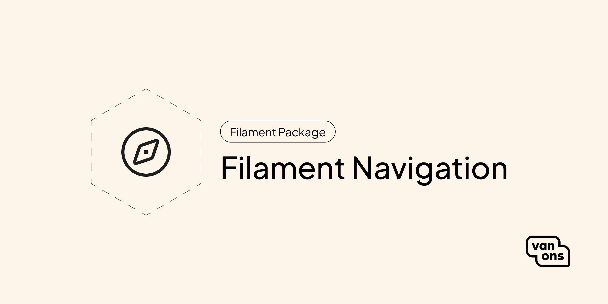

<p align="center" class="filament-hidden"></p>

# Filament Navigation

[](https://github.com/VanOns/filament-navigation/releases)
[](https://packagist.org/packages/van-ons/filament-navigation)
[](https://github.com/VanOns/filament-navigation/issues)
[](https://github.com/VanOns/filament-navigation/blob/main/LICENSE.md)

This plugin for Filament provides a `Navigation` resource that lets you build structural navigation menus with a clean drag-and-drop UI.

## Quick start

> For Filament version compatibility, see [Compatibility](docs/compatibility.md).

### Installation

Start by installing the package via Composer:

```bash
composer require van-ons/filament-navigation:^2.0
```

Next, run the migrations:

```sh
php artisan migrate
```

Finally, publish the package's assets:

```sh
php artisan filament:assets
```

### Usage

You first need to register the plugin with Filament. This can be done inside your `PanelProvider`, e.g. `AdminPanelProvider`:

```php
use VanOns\FilamentNavigation\FilamentNavigation;

return $panel
    ->plugin(FilamentNavigation::make());
```

If you wish to customize the navigation group, sort or icon, you can use the `NavigationResource::navigationGroup()`,
`NavigationResource::navigationSort()` and `NavigationResource::navigationIcon()` methods.

## Documentation

Please see the [documentation](docs) for detailed information about installation and usage.

## Contributing

Please see [Contributing](CONTRIBUTING.md) for more information about how you can contribute.

## Testing

```bash
composer test
```

## Changelog

Please see [Changelog](CHANGELOG.md) for more information about what has changed recently.

## Upgrading

Please see [Upgrading](UPGRADING.md) for more information about how to upgrade.

## Security

Please see [Security](SECURITY.md) for more information about how we deal with security.

## Credits

We would like to thank the following contributors for their contributions to this project:

- [Ryan Chandler](https://github.com/ryangjchandler) (original author)
- [All contributors](../../contributors)

## License

The scripts and documentation in this project are released under the [MIT License](LICENSE.md).

---

<p align="center"><a href="https://van-ons.nl/" target="_blank"></a></p>
